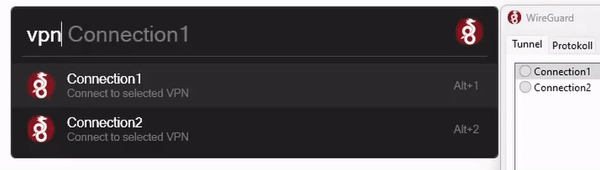

# Flow-Launcher WireGuard Plugin

This plugin allows to establish a connection with a [WireGuard](https://www.wireguard.com/) VPN interface via [FlowLauncher](https://www.flowlauncher.com/).

## Getting Started

These instructions will get you a copy of the project up and running on your local machine for development and testing purposes.

### Prerequisites

To install and use this plugin, you will need the following:

- [FlowLauncher](https://www.flowlauncher.com/)
- [WireGuard Windows Client](https://www.wireguard.com/install/#windows-7-81-10-11-2008r2-2012r2-2016-2019-2022)

Please make sure you have the latest versions of both installed before proceeding.

### Installing

#### FlowLauncher

Run `pm install WireGuard` in FlowLauncher to install this plugin

#### Manual
Unzip [the latest version](https://github.com/flooxo/Flow.Plugin.WireGuard/releases) into your plugin directory (default: `%appdata%\FlowLauncher\Plugins` or run `userdata` in FlowLauncher)

## Configuration

| Setting     | Type    | Default                                             | Description                                  |
|-------------|---------|-----------------------------------------------------|----------------------------------------------|
| `config path` | string  | `C:\Program Files\WireGuard\Data\Configurations\` | path to your WireGuard interface configurations |

## Usage

- actionword: `vpn`

When the actionword is called, it displays all the available VPN interfaces from the configuration.
The user can select a interface to connect to it. If the interface is already connected, selecting it again will disconnect the connection.
If the user already has an active VPN connection, selecting a new interface will switch the connection to the new interface.

*Info:*
- Therefore, it is only possible to be connected to one VPN interface at a time.
- Admin rights are required due to encrypted `.conf` files (for further details see [WireGuard Tunnel Service](https://github.com/WireGuard/wireguard-windows/blob/master/docs/enterprise.md#tunnel-service))

## License

This project is licensed under the MIT License - see the [LICENSE.md](LICENSE.md) file for details
